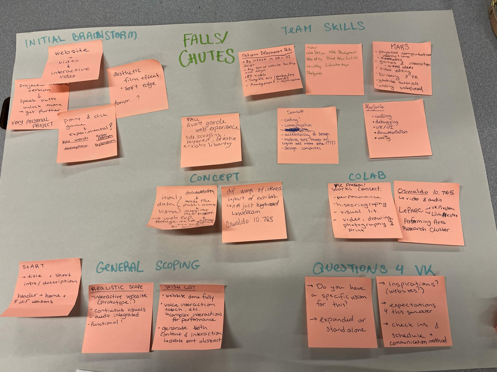

# CART-470
### Week 2) 16/09/26 - 22/09/26

#### Studio Work

The brief seems rather vague at first view; as a whole the project appears very dear & close to the client so it'll be important to get a clear idea on their vision of it and what scope is expected of us ASAP.

Oswaldo is our liaison for video/audio access (@EV-10.765)

Took initiative in setting up the Fizzy Kanban for the team.

#### Home Work
\-

---

#### Coming Up Next

- First client meeting) Sept. 23 @10:30
    - specific vision, inspiration they have for this project
    - project as standalone or to be expanded
    - what scope is expected of us
    - frequency/location of check-ins
    - best means of comms, with which collaborators
- Figure out concrete team members' roles
- Living Learning Contract team submission) Sept. 30th

<b>[Back to main](https://github.com/zettaMarge/CART-470) --- </b> Next Entry
