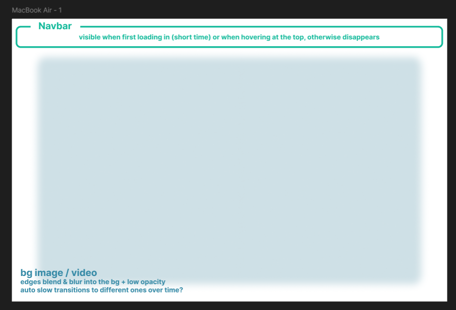
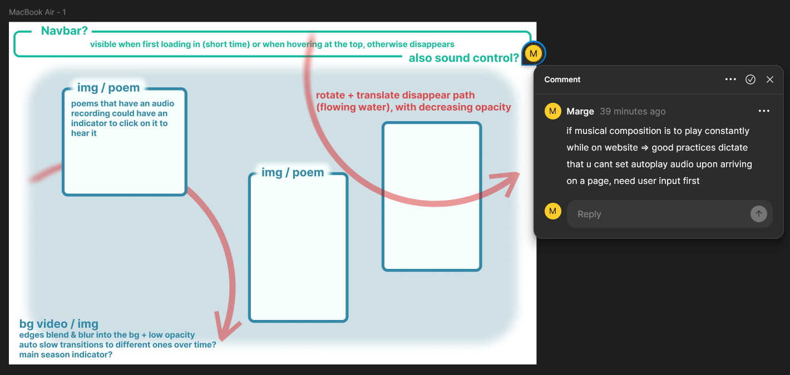
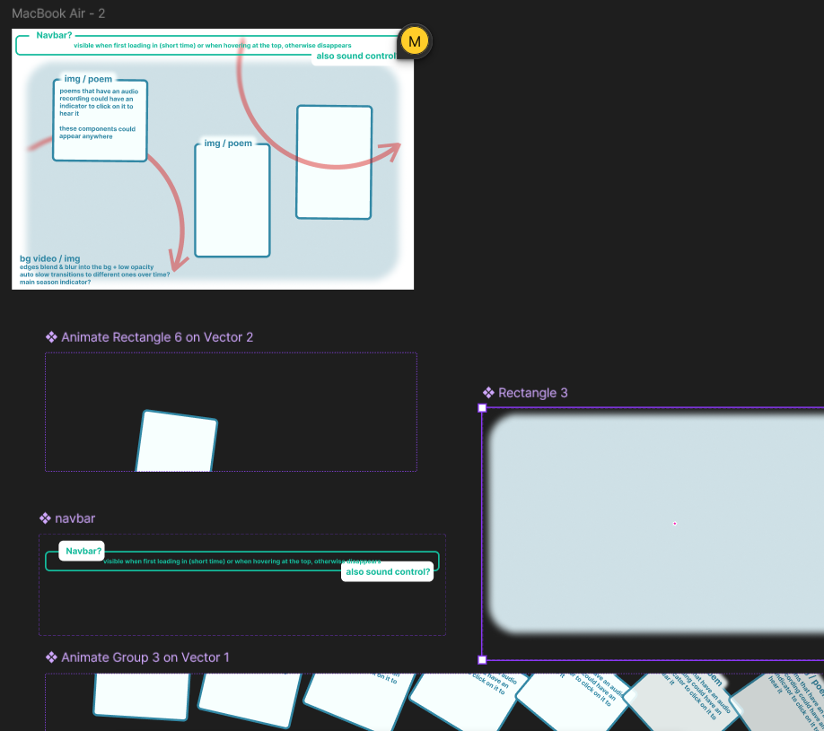

# CART-470
### Week 4) 30/09/26 - 06/10/26

### Studio Work
Class Meeting recap:
- project is very open, so still trying to figure out a feasible scope
- living learning contract:
    - milestone 1: UX design, what goes in the website + general idea of the look
    - milestone 2: start building the website with placeholders
    - milestone 3: add in actual content, doc to add in later content
    - endgoal is 100% a website/web experience
- current worry is that it's difficult to have VK commit with a specific concrete prototype to go forward with, we have to lead a bit more. come up with a few alternatives (3) of how the website could function (using only partial scroll), how to map out the flow
- experience doesnt need to be static (not always the same starting point, different order), or how to game-ify it to affect the outcome, conversation between the website & the visitors -> focus on the dynamics
- keep in mind how to integrate the project brief/team presentation in the whole experience
- to discuss soon: hosting environment (who to speak to for the hosting situation for permissions/what can run/database/etc NOT WORDPRESS!!!)

Library Meetup Recap:
- Oswaldo(?) will email us with the procedure to access the assets folder on the Fine Arts server
- focus on the spiral / snakes & ladders / loops sliding into one another concept for the prototypes
- having a private website access with username & password for ??? viewing WIP sections? in addition to the public access
- bjork website as potential inspiration

Otherwise we plan to hold a meeting thursday evening to discuss our next steps/prototype ideas.

### Home Work
Thursday Meeting Recap:
- discord server created for more organized communications between each other, including a channel containing links to all the resources sent by VK so far
- idea of the map not visible at first, only at the end to show the user's path through the experience
- rough/low-fidelity prototypes
- will have a 2nd call on monday 7:30-8pm to narrow down which prototypes will be shown to VK

<b>[Prototype editor link](https://www.figma.com/design/v9fZIHNBLT2a53KlFj6Uwo/CART470-Prototype?node-id=0-1&p=f&t=uDio7ZmzZCUqPR9b-0)</b>

Very rough prototyping start with basic wireframing, which kind of makes it difficult to effectively convey the ideas/concepts, but could add Figma interactions for easier conceptualization (disappearing nav, shifting colour of "bg image" to simulate it changing, etc)

Decided it would be best to wait for the monday group meeting before adding the Figma interactions, in case my prototype isn't selected / needs to be edited first.

Monday Meeting Recap:
- Scarlett could not attend due to internet issues
- all prototypes have very interesting & different interpretations / concepts, all in agreement to keep them all for the presentation since VK might like different elements of them
- only preparation left for this week is to refine what still needs refining in our prototypes / add transitions
- Tatiana sent the Fizzy link
- reminded the others to post their figma links as comments in Fizzy to tie in task progress

Wasn't able to get the navbar dis/reappearing transition to affect the size of the background like i wanted (i.e. to mimic it taking up the newly available space), but the colour transition works. The rotating/disappearing images works great also.

<b>[Interactive prototype link](https://www.figma.com/proto/v9fZIHNBLT2a53KlFj6Uwo/CART470-Prototype?node-id=16-2&p=f&t=FsQ6B24HjocWUt5Y-0&scaling=scale-down&content-scaling=fixed&page-id=0%3A1)</b>

---

### Coming Up Next

- Milestone 1: Figma prototype) Oct. 21
- Present prototypes to VK) Oct. 7 @10:00

---

<b>[Prev. Entry](https://github.com/zettaMarge/CART-470/tree/W3-entry) --- [Back to main](https://github.com/zettaMarge/CART-470) --- </b> Next Entry 

